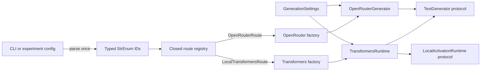
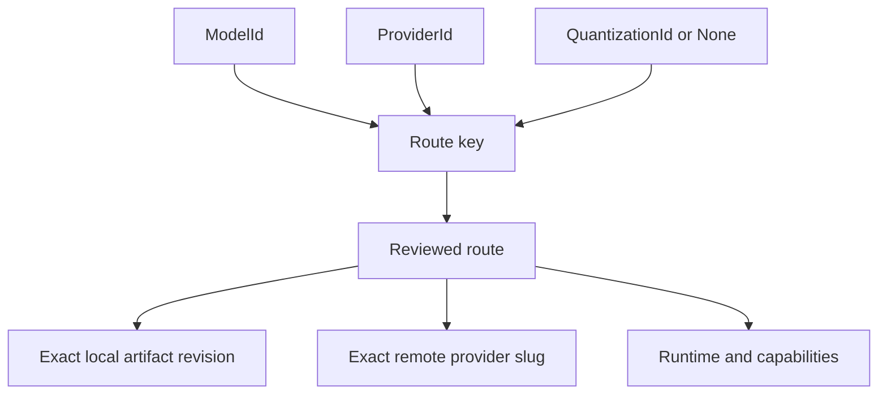
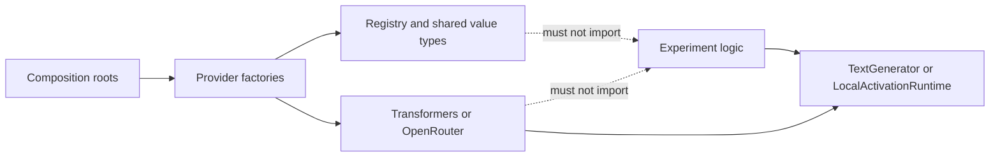

# LLM Runtime

`llm_runtime` is the shared, typed boundary between experiments and model
providers. It keeps a model's research identity separate from its provider,
quantization, artifact revision, credentials, and per-run generation settings.

The package is intentionally a small closed registry, not a universal inference
framework. Its design comes from [GitHub issue #1](https://github.com/ananyasingh8/llm-rudeness-preferences/issues/1),
updated here to describe the implemented API and current experiment scope.

## Problem

Provider construction was previously embedded in individual experiments. That
made it possible for two experiments to use inconsistent model identities,
arbitrary provider slugs, or incompatible model/provider/quantization
combinations. Errors could occur deep inside an experiment after expensive work
had already started.

The shared runtime provides one reviewed construction boundary so experiments
can:

- select model and provider identities consistently;
- swap reviewed quantizations without changing experiment logic;
- inject text generation without importing provider SDKs;
- retain the real local PyTorch model and tokenizer for activation work;
- reject unsupported routes before generation, download, or HTTP work;
- keep credentials and generation settings out of model identity.

## Design Principles

- Public identifiers are strongly typed `StrEnum` members, not raw strings.
- Dynamic CLI and environment strings are parsed once at the construction
  boundary.
- Registry entries are static, immutable, reviewed, and fail closed.
- Model identity does not encode provider, quantization, or artifact location.
- Local artifact revisions and remote provider slugs are registry metadata.
- Experiments depend on structural protocols, not provider implementations.
- Remote generation does not pretend to provide local activation access.
- Unsupported combinations never silently fall back to another model or
  precision.

## Architecture



The identity axes remain independent:



## Dependency Direction



In text form:

```text
experiment logic -> TextGenerator / LocalActivationRuntime protocols
composition roots -> provider factories
provider adapters -> registry + shared value types
registry/adapters -X-> experiment packages
```

## Public Types

The main package exports these identifiers:

```python
from llm_runtime import (
    Capability,
    MessageRole,
    ModelId,
    ProviderId,
    QuantizationId,
    RouteAvailability,
    RuntimeId,
)
```

Current enum values are:

| Type | Values |
|---|---|
| `ModelId` | `GEMMA_4_E2B_IT`, `GEMMA_4_31B_IT`, `GEMMA_2_2B_IT`, `DOLPHIN_MISTRAL_24B_VENICE` |
| `ProviderId` | `LOCAL`, `OPENROUTER` |
| `QuantizationId` | `BF16`, `W4A16_COMPRESSED_TENSORS`, `BITSANDBYTES_FP4` |
| `RuntimeId` | `TRANSFORMERS`, `OPENAI_COMPATIBLE_HTTP` |
| `Capability` | `TEXT_GENERATION`, `LOCAL_ACTIVATIONS` |
| `MessageRole` | `SYSTEM`, `USER`, `ASSISTANT` |

Strings are accepted only at external boundaries such as `argparse`. Internal
APIs carry enum members through route resolution and generation.

### Messages And Settings

```python
from llm_runtime import ChatMessage, GenerationSettings, MessageRole

messages = [ChatMessage(MessageRole.USER, "Hello")]
settings = GenerationSettings(max_new_tokens=256, temperature=0.0)
```

`GenerationSettings` is per-run state, not registry metadata. Construction
rejects non-positive token limits and non-finite or negative temperatures before
provider work begins.

### Text Generation Protocol

```python
class TextGenerator(Protocol):
    @property
    def model_id(self) -> ModelId: ...

    @property
    def provider_id(self) -> ProviderId: ...

    @property
    def quantization_id(self) -> QuantizationId | None: ...

    def generate(
        self,
        messages: Sequence[ChatMessage],
        settings: GenerationSettings,
    ) -> str: ...
```

Behavioral experiment code can accept this protocol and use a local runtime, a
remote generator, or a focused fake without provider-specific branches.

## Closed Route Registry

Routes are keyed by:

```text
(ModelId, ProviderId, QuantizationId | None)
```

The registry currently contains:

| Model | Provider | Quantization | Runtime | Status | Capabilities |
|---|---|---|---|---|---|
| `GEMMA_4_E2B_IT` | `LOCAL` | `BF16` | `TRANSFORMERS` | enabled | text generation, local activations |
| `GEMMA_4_E2B_IT` | `LOCAL` | `W4A16_COMPRESSED_TENSORS` | `TRANSFORMERS` | unavailable | none |
| `GEMMA_4_31B_IT` | `LOCAL` | `BITSANDBYTES_FP4` | `TRANSFORMERS` | enabled | text generation, local activations |
| `GEMMA_4_31B_IT` | `LOCAL` | `W4A16_COMPRESSED_TENSORS` | `TRANSFORMERS` | enabled | text generation, local activations |
| `GEMMA_2_2B_IT` | `LOCAL` | `BF16` | `TRANSFORMERS` | enabled | text generation, local activations |
| `DOLPHIN_MISTRAL_24B_VENICE` | `OPENROUTER` | `None` | `OPENAI_COMPATIBLE_HTTP` | enabled | text generation |

Resolve a route once:

```python
from llm_runtime import ModelId, ProviderId, QuantizationId, resolve_route

route = resolve_route(
    ModelId.GEMMA_4_E2B_IT,
    ProviderId.LOCAL,
    QuantizationId.BF16,
)
```

`resolve_route()` rejects unknown triples, unavailable routes, and missing
capabilities with actionable alternatives. Provider constructors also reject
manually forged route dataclasses, arbitrary repositories, and arbitrary remote
slugs.

### BF16 Gemma Route

- Repository: `google/gemma-4-E2B-it-qat-q4_0-unquantized`
- Revision: `6befbaca7398925921802abd1f277b495b78b738`
- Context window: 131,072 tokens
- Runtime weight dtype: BF16
- Capabilities: text generation and local activations

`qat-q4_0` describes the quantization-aware training target. The pinned artifact
stores and executes high-precision BF16 weights; the runtime does not infer
quantization from the repository name.

### W4A16 Candidate

- Repository: `google/gemma-4-E2B-it-qat-w4a16-ct`
- Revision: `971342c08f607aa7779983f6b5289778b5d271a7`
- Intended loader: Compressed Tensors W4A16
- Status: unavailable with no capabilities

Metadata parsing alone does not prove executable compatibility. This route must
remain unavailable until the exact pinned revision passes real weight loading,
text generation, and model/tokenizer activation-access validation. It never
falls back to BF16.

### W4A16 Gemma 4 31B Route

- Repository: `google/gemma-4-31B-it-qat-w4a16-ct`
- Revision: `52f3f65bc7a02d555763bc923bd1d9094898219d`
- Context window: 131,072 tokens
- Loader: Compressed Tensors W4A16 (requires the locked `compressed-tensors`
  dependency); ~17–18 GB of weights on a 24 GB GPU
- Capabilities: text generation and local activations

This older route remains available for existing callers, but Compressed Tensors
W4A16 is not the reviewed extraction-compatible ConvAbuse route. The gemotions
source loaded the base model through BitsAndBytes, and different 4-bit formats
must not be treated as numerically equivalent. The repository is not gated.

### BitsAndBytes FP4 Gemma 4 31B Route

- Repository: `google/gemma-4-31B-it`
- Revision: `842da3794eaa0b77d5f08bae87a17459d91ff475`
- Loader: locked direct `bitsandbytes` dependency through Transformers
- Recipe: `load_in_4bit=True`, FP4, BF16 compute, UINT8 quantized storage, and
  `bnb_4bit_use_double_quant=False`
- Placement: requested and resolved maps are recorded; this reviewed route
  rejects CPU/disk placement rather than silently offloading
- Capabilities: text generation and local activations

This route is the closed `convabuse-31b-local-quant` probing route. Cache-only construction
preserves the real model and tokenizer. The full base repository requires 60+ GB
of download/cache/disk capacity even though weights are quantized during load.
The exact locked route passed a one-example smoke run on a 24 GB RTX 4090 at
18.44 GiB peak allocated and 18.50 GiB peak reserved CUDA memory, with every
named parameter and buffer verified on `cuda:0`. This does not establish
numerical equivalence with the historical extraction environment.

### BF16 Gemma 2 Route

- Repository: `google/gemma-2-2b-it`
- Revision: `299a8560bedf22ed1c72a8a11e7dce4a7f9f51f8`
- Context window: 8,192 tokens
- Runtime weight dtype: BF16
- Capabilities: text generation and local activations

This route exists for the emotion-probing experiment: the EmotionScope emotion
vectors were extracted from this exact model, and emotion vectors are
model-specific. The repository is gated on Hugging Face — accept the Gemma
license and authenticate with `hf auth login` before downloading.

### OpenRouter Dolphin Route

- Provider slug: `cognitivecomputations/dolphin-mistral-24b-venice-edition`
- Endpoint: `https://openrouter.ai/api/v1/chat/completions`
- Quantization: `None` because OpenRouter provides no enforceable contract
- Capability: text generation only

A remote provider slug identifies a gateway route, not a reproducibly pinned
weight revision. Remote and local runs must not be treated as artifact-equivalent.

## Local Transformers Runtime

The local adapter preserves the real PyTorch model and tokenizer:

```python
from pathlib import Path

from llm_runtime import (
    LocalTransformersRoute,
    ModelId,
    ProviderId,
    QuantizationId,
    resolve_route,
)
from llm_runtime.transformers import Device, create_transformers_runtime

route = resolve_route(
    ModelId.GEMMA_4_E2B_IT,
    ProviderId.LOCAL,
    QuantizationId.BF16,
)
if not isinstance(route, LocalTransformersRoute):
    raise AssertionError(f"unexpected closed route: {type(route).__name__}")
runtime = create_transformers_runtime(
    route,
    cache_dir=Path.home() / ".cache/huggingface/hub",
    device=Device.AUTO,
)
```

`TransformersRuntime` satisfies `TextGenerator`. It also satisfies
`LocalActivationRuntime`, which exposes:

```python
runtime.model      # torch.nn.Module
runtime.tokenizer  # PreTrainedTokenizerBase
runtime.placement  # requested/resolved device map and CPU/disk offload state
```

Future emotion-probe code should require `LocalActivationRuntime`. The checked
mypy fixture in `typing_tests/local_activation_boundary.py` proves that an
`OpenRouterGenerator` cannot satisfy this protocol.

Local construction is cache-only. Downloading is a separate explicit operation,
and no network fallback or alternate precision is attempted while loading.

## OpenRouter Runtime

Credentials come only from `OPENROUTER_API_KEY`:

```python
from llm_runtime import ModelId, OpenRouterRoute, ProviderId, resolve_route
from llm_runtime.openrouter import (
    create_openrouter_generator,
    openrouter_credentials_from_env,
)

route = resolve_route(
    ModelId.DOLPHIN_MISTRAL_24B_VENICE,
    ProviderId.OPENROUTER,
    None,
)
if not isinstance(route, OpenRouterRoute):
    raise AssertionError(f"unexpected closed route: {type(route).__name__}")

with create_openrouter_generator(
    route,
    credentials=openrouter_credentials_from_env(),
) as generator:
    response = generator.generate(messages, settings)
```

Credentials are excluded from representations and errors. The adapter accepts
an injected `httpx.Client` for tests and caller-managed lifetimes. Internally
created clients use a 60-second timeout and are closed by the context manager.

Failures use `GenerationFailureKind` rather than string categories. Transport
errors and HTTP 408, 429, 500, 502, 503, and 504 are retryable; authentication,
validation, and malformed successful responses are permanent. Numeric
`Retry-After` values are capped at 30 seconds.

## Experiment Integration

### Quadratic Voting

`quadratic_voting.conversation.run_conversation()` accepts `TextGenerator`.
Provider construction and enum parsing remain in the CLI composition root. See
[`quadratic_voting/README.md`](../quadratic_voting/README.md) for commands and
defaults.

### Emotion Probes

`emotion_probing.main` resolves the Gemma 2 BF16 or Gemma 4 31B BitsAndBytes FP4
route with `required={Capability.LOCAL_ACTIVATIONS}` and reads activations through
the `LocalActivationRuntime` protocol (`runtime.model` / `runtime.tokenizer`). A
remote route fails before the experiment starts, while static typing rejects a
remote generator assignment. The probe also verifies that its emotion-vectors
file was extracted from the exact repository the resolved route loads. See
[`emotion_probing/README.md`](../emotion_probing/README.md).

For ConvAbuse, the scoped hook captures only decoder block 40 output, checks
batch one/rank/5,376 width/the 512-token bound, and selects the final prompt
token. Runs use `torch.inference_mode()` and `use_cache=False`. Provenance records
the exact recipe and package versions, placement/offload state, and synchronized
CUDA peak allocated/reserved bytes. The historical extraction source omitted
FP4/storage/double-quant and exact versions, so this likely-default reviewed route
does not prove numerical equivalence to those historical activations.

### Bail Behavior

The active Bail experiment and its completed augmentation pipeline intentionally
remain unchanged from `origin/main`. This package does not alter or re-run them
while experiments are active. A future migration can inject `TextGenerator`
without changing the registry API.

## Adding A Model Or Quantization

1. Add a strongly typed enum identity only if the research model or
   quantization is genuinely new.
2. Add a static route keyed by the exact model, provider, and quantization IDs.
3. Pin local repositories and revisions, or fix the exact reviewed remote slug.
4. Declare only capabilities verified on that exact route.
5. Add adapter tests for construction, serialization, failures, and cleanup.
6. For local routes, validate exact artifact loading and real generation.
7. Validate model/tokenizer exposure before declaring local activation access.
8. Update this route table and experiment documentation.

Do not add an arbitrary-slug escape hatch, infer quantization from a repository
name, or silently route to another precision.

## Validation

Routine checks do not download model weights or call OpenRouter live:

```console
uv run python -m unittest discover -v
uv run ruff format --check llm_runtime quadratic_voting
uv run ruff check llm_runtime quadratic_voting
uv run mypy llm_runtime quadratic_voting
uv run mypy --warn-unused-ignores typing_tests/local_activation_boundary.py
```

The focused tests verify:

- every route, status, capability declaration, and invalid triple;
- exact local repository, revision, loader options, and BF16 dtype;
- provider-independent conversation injection;
- OpenRouter endpoint, slug, messages, settings, parsing, and timeout;
- malformed, transport, retry, and credential-redaction behavior;
- owned and injected HTTP-client lifetimes;
- the static local-activation protocol boundary.

The opt-in metadata check downloads only small Hub metadata and tokenizer files:

```console
RUN_HF_INTEGRATION=1 uv run python -m unittest -v \
  llm_runtime.test_transformers.TransformersRuntimeTests.test_pinned_bf16_metadata_and_text_chat_template
```

On NixOS, enter `nix develop` before real CUDA inference. The development shell
provides a compiler and sets `TRITON_LIBCUDA_PATH=/run/opengl-driver/lib` so
Triton does not assume the FHS-only `/sbin/ldconfig` path.

## Acceptance Criteria

- **Given** a registered model selection **when** experiment code uses it
  **then** it carries `ModelId` and `ProviderId` **and should not** bypass the
  registry with raw strings.
- **Given** a local route **when** weights are selected **then** it carries a
  `QuantizationId` and exact artifact revision **and should not** infer precision
  from a repository name.
- **Given** an unsupported triple **when** it is resolved **then** it fails with
  alternatives and corrective action **and should not** silently fall back.
- **Given** local Gemma BF16 **when** its factory runs **then** it preserves real
  model and tokenizer access **and should not** make a remote request.
- **Given** Dolphin through OpenRouter **when** it generates **then** it sends the
  registered slug and typed settings **and should not** expose activations.
- **Given** missing OpenRouter credentials **when** construction runs **then** it
  fails before HTTP work **and should not** leak or persist credentials.
- **Given** generation settings vary **when** requests run **then** settings remain
  separate from identity, artifacts, provider metadata, and credentials.
- **Given** routine quality gates **when** they run **then** they pass without
  model-weight downloads or live paid-provider calls.

## Non-Goals

- Implementing Bail classification, vector re-extraction, or QV voting mechanics.
- A plugin system, service locator, or provider/model class hierarchy.
- Arbitrary user-provided model or quantization strings.
- User-supplied runtime quantization recipes or parameters outside static routes.
- Streaming, batching, multimodal input, embeddings, log probabilities, tools,
  or cost accounting before an experiment requires them.
- A remote activation API.
- Adding vLLM, llama.cpp, NNsight, LiteLLM, or additional providers in this
  package revision.
- Compatibility aliases for superseded constructors or constants.

## Risks And Decisions

- A closed registry requires a code review to add a route. That friction protects
  experimental consistency.
- Quantization identity describes an execution artifact variant, not its training
  method. Training target, storage format, weight dtype, activation dtype, and
  revision remain separate facts.
- OpenRouter quantization is `None` until the provider offers an enforceable
  contract; marketing names are not sufficient evidence.
- `TextGenerator` is intentionally the smallest common text interface.
  Activation access remains a separate local-only protocol.
- Full local weight loading, VRAM use, long-context behavior, and activation
  coverage remain operator/integration checks rather than routine unit tests.
